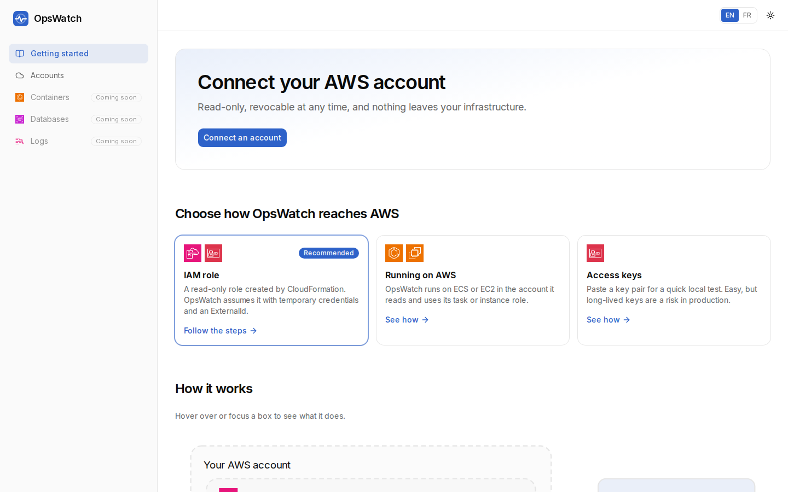
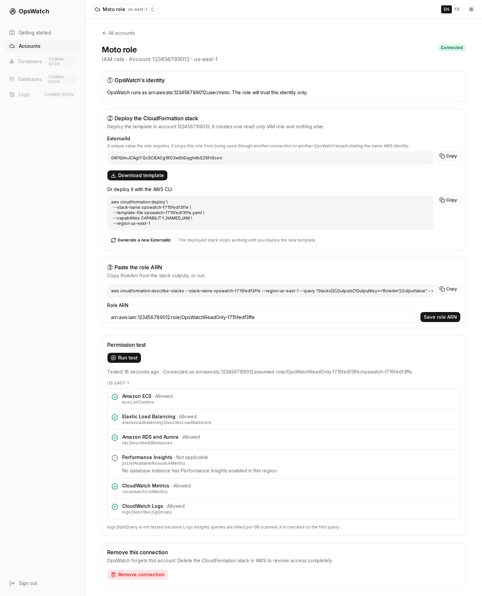
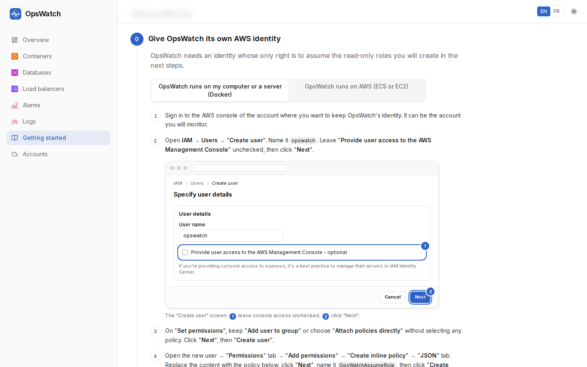
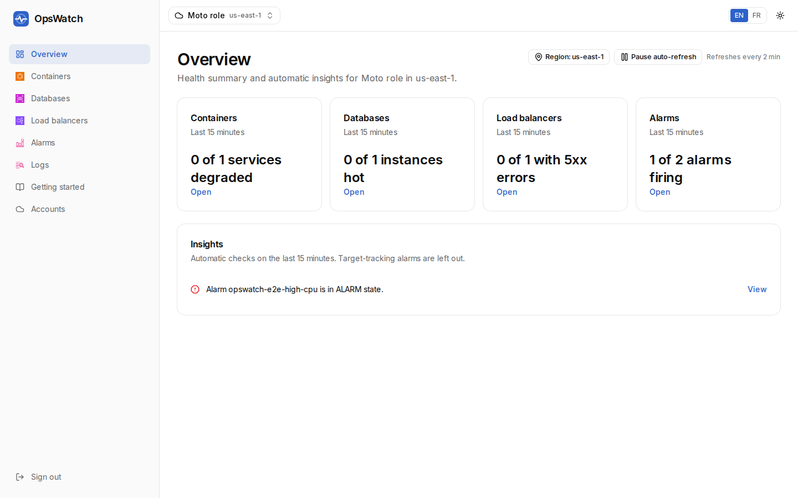

# OpsWatch

**Self-hosted, open source monitoring for your AWS containers, databases and logs.**

[Français](README.fr.md) · [License: MIT](LICENSE)

OpsWatch runs on your own infrastructure and reads your AWS accounts with read-only access.
Nothing leaves your network: no SaaS, no agent to install in your workloads.

There is also an **iOS and Android app** for checking on things away from a desk — see
[Mobile app](#mobile-app) and [`docs/mobile/`](docs/mobile/README.md).



## Status

OpsWatch is built in stages. This release covers the foundations and live monitoring:

| Stage | Content | Status |
|-------|---------|--------|
| 1 | Admin account, AWS connections, permission test, getting started guide (English and French) | Available |
| 2 | Live monitoring: Overview with automatic insights, Containers (ECS), Databases (RDS, Aurora, Performance Insights), Load balancers (ALB), Alarms, Logs (CloudWatch Logs Insights) | Available |
| 3 | History storage and on-demand snapshots | Planned |
| 4 | Notifications | Planned |
| 5 | More AWS services (SQS, Lambda, EC2/EBS) and a multi-account overview | Planned |

## Quick start

Requirements: Docker with Compose v2.

```bash
git clone https://github.com/<owner>/opswatch.git
cd opswatch
cp .env.example .env
# Put at least 32 random characters in OPSWATCH_SECRET:
sed -i "s|^OPSWATCH_SECRET=.*|OPSWATCH_SECRET=$(openssl rand -base64 48 | tr -d '\n')|" .env
docker compose up -d --build
```

Open http://localhost:3000. The first visit asks you to create the admin account, then the
getting started guide walks you through connecting an AWS account.

`docker-compose.yml` publishes the port on `127.0.0.1` only: until the admin account exists,
whoever opens OpsWatch first can create it. To reach OpsWatch from other machines, finish the
admin setup first, then put it behind a reverse proxy with HTTPS, set `OPSWATCH_PUBLIC_URL` in
`.env` to its public address and let the proxy forward to `127.0.0.1:3000`. The image reads
`OPSWATCH_PUBLIC_URL` when it is built too (forms only accept that host), so run
`docker compose up -d --build` again after changing it.

OpsWatch refuses to start if `OPSWATCH_SECRET` is missing or shorter than 32 characters.
Keep this value safe: it encrypts stored access keys and signs sessions, and changing it
signs everyone out and makes stored keys unreadable.

## Sign in with Google

Optional. The admin can also sign in with the Google account whose email is the admin email.
Email and password keep working, and the admin account is still created on the setup page.
Google sign-in stays off unless `OPSWATCH_GOOGLE_CLIENT_ID`, `OPSWATCH_GOOGLE_CLIENT_SECRET` and
`OPSWATCH_PUBLIC_URL` are all set.

1. In the Google Cloud console, open "APIs & Services" → "OAuth consent screen". Choose the user
   type Internal (Google Workspace) or External, name the app OpsWatch and give a support email.
2. Open "Credentials" → "Create credentials" → "OAuth client ID", with application type
   "Web application".
3. Add the authorized redirect URI `<OPSWATCH_PUBLIC_URL>/api/auth/google/callback`. To try it on
   this machine: `http://localhost:3000/api/auth/google/callback` with
   `OPSWATCH_PUBLIC_URL=http://localhost:3000`.
4. Copy the client ID and secret into `.env` as `OPSWATCH_GOOGLE_CLIENT_ID` and
   `OPSWATCH_GOOGLE_CLIENT_SECRET`, then restart OpsWatch. With Docker, run
   `docker compose up -d --build`: `OPSWATCH_PUBLIC_URL` is also read when the image is built.
5. On the sign-in page, choose "Continue with Google" and use the Google account whose email
   is the OpsWatch admin email.

Only a verified Google email equal to the admin email is accepted. Set
`OPSWATCH_GOOGLE_ALLOWED_DOMAIN` (for example `example.com`) to also require an account of that
Google Workspace domain. If the client ID and secret are set without `OPSWATCH_PUBLIC_URL`,
OpsWatch logs a warning at startup and keeps Google sign-in off.

## Connecting AWS



OpsWatch offers three methods. The guide inside the application explains each one step by step.

<picture>
  <source media="(prefers-color-scheme: dark)" srcset="docs/screenshots/guide-steps-dark.png">
  
</picture>

1. **IAM role (recommended).** OpsWatch generates a CloudFormation template that creates a
   read-only role named `OpsWatchReadOnly-<id>` in the monitored account. The role trusts only
   OpsWatch's own AWS identity, and only when it presents a random ExternalId unique to the
   connection. OpsWatch assumes the role and receives temporary credentials valid for one hour.
2. **Ambient credentials.** OpsWatch uses the identity it already runs with: an ECS task role,
   an EC2 instance profile, or `AWS_ACCESS_KEY_ID` and `AWS_SECRET_ACCESS_KEY` in `.env`
   (an `AWS_PROFILE` works with `npm run dev`; when keys and a profile are both set, the keys win).
3. **Access keys.** An IAM user's access key pair, encrypted at rest. Use this only when the
   other two methods are not possible.

**Launch Stack (experimental).** When `OPSWATCH_TEMPLATE_BUCKET` is set, the role method also
offers a "Launch Stack" button: OpsWatch uploads the template to that bucket (its identity needs
`s3:PutObject` on it) and opens the CloudFormation console. The console user of the monitored
account must be able to read the template object, for example through a bucket policy granting
`s3:GetObject` on `opswatch/templates/*`. This option has not been validated against a real AWS
account yet; downloading the template is the tested path.

After connecting, **Run test** calls one read-only action per service and region, and shows
what OpsWatch can and cannot see.

## Monitoring pages



Pick a connection in the top bar, then a region. Every page reads AWS live; nothing is stored.

- **Overview**: health summary and automatic insights (tasks below desired, over the last 10 minutes; everything else — CPU or memory above 85 %, failed or stuck deployments, database CPU above 80 %, free memory below 5 %, Aurora replica lag above 1 s, load balancer 5xx errors, unhealthy hosts, alarms in ALARM state — over the last 15 minutes). A threshold must hold for 3 consecutive minutes to raise an insight.
- **Containers**: ECS clusters and services (up to 100 per cluster, with search), then per service CPU and memory charts, running tasks, recent events, target groups and log groups.
- **Databases**: RDS and Aurora instances with role, CPU, connections, free memory and replica lag; per instance charts and Performance Insights top SQL.
- **Load balancers**: application load balancers with requests, 5xx errors, p95 response time and target health.
- **Alarms**: CloudWatch alarms by state; target-tracking autoscaling alarms are hidden by default.
- **Logs**: pick log groups by prefix and run CloudWatch Logs Insights queries over at most 24 hours (1,000 rows); a query stops after 60 seconds or when you leave the page. `logs:StartQuery` is billed per GB of logs scanned.

Charts cover 1 hour to 7 days (`?range=`) and refresh every 2 minutes while the tab is visible; the refresh can be paused. When a permission is missing, the card says which IAM action and links to the permission test; the rest of the page still loads.

### What monitoring costs

`cloudwatch:GetMetricData` is billed per metric requested: about USD 0.01 per 1,000 metrics (see CloudWatch pricing for your region). OpsWatch requests one metric per series it shows and refreshes only visible tabs; the 60-second cache is shorter than the 120-second refresh, so it only saves calls when more than one person watches the same page at once. The Containers list requests two metrics per service, CPU and memory (Container Insights, when enabled, adds task-count metrics only on the per-service and Overview pages, not on this list). Watching a Containers page with 30 services for 8 hours is 240 refreshes of 60 metrics each, about 14,400 metrics, roughly USD 0.14. The Overview, which opens by default, costs more because it covers every service at once: it requests two metrics per ECS service (four when Container Insights is on, which adds running and desired tasks), two to three per database instance (CPU and freeable memory, plus replica lag for an Aurora reader), three per load balancer and one per target group; alarms are read with describe calls only. For an account with about 30 services, 9 database instances and 4 load balancers, that is roughly 160 metrics per refresh, so 8 hours on the Overview is about 38,400 metrics, roughly USD 0.38. Its four summary cards and its insights list share one fetch per family, but two tabs on different pages never share a cache entry: each page asks for its own set of metrics, so watching the Overview and the Containers list side by side costs the sum of the two. Describe calls to ECS, RDS and Elastic Load Balancing are not billed.

## Security model

- Every AWS call runs on the server. Credentials never reach the browser.
- The generated role only allows read actions: the full list is in the guide and in
  `src/lib/aws/actions.ts`. OpsWatch's own identity only needs `sts:AssumeRole` on
  `arn:aws:iam::*:role/OpsWatchReadOnly-*`.
- The trust policy of the generated role already limits it to this OpsWatch instance's AWS
  identity. The ExternalId adds protection against the confused deputy case, where several
  OpsWatch instances or tenants share one base identity and one could be pointed at another's
  role, and against a connection being configured with another connection's role.
- Access keys are encrypted with AES-256-GCM using a key derived from `OPSWATCH_SECRET`.
- A single admin account protects the instance. Passwords are hashed with argon2id, sessions
  expire after 12 hours of inactivity, and sign-in attempts are limited to 5 per minute per client.
- Client addresses can be forged, so sign-ins are also watched globally. Once more than 20
  sign-ins failed in the last minute, OpsWatch checks passwords one at a time, at least
  3 seconds apart, and refuses new attempts while more than 50 are already waiting. The admin
  is never locked out: the right password still works during an attack, after a wait.
- Optional Google sign-in uses OpenID Connect with PKCE, state and nonce, verifies the ID token,
  and only accepts the verified admin email. A Google sign-in that fails or is refused after
  it started counts toward the global sign-in watch above, like a wrong password; one cancelled
  on Google's page does not.
- Put OpsWatch behind HTTPS and set `OPSWATCH_PUBLIC_URL` so cookies are marked `Secure`.

Report vulnerabilities privately as described in [SECURITY.md](SECURITY.md).

## Configuration

| Variable | Required | Purpose |
|----------|----------|---------|
| `OPSWATCH_SECRET` | Yes, 32+ characters | Encrypts stored access keys and signs sessions |
| `OPSWATCH_DATA_DIR` | No, default `/data` | Where the database lives. **Docker Compose ignores this and always uses `/data`** — see [Your data](#your-data) |
| `OPSWATCH_PUBLIC_URL` | No | Public URL; enables `Secure` cookies over HTTPS and lets forms post from that host (also read at build time: rebuild after changing it) |
| `OPSWATCH_TEMPLATE_BUCKET` | No | S3 bucket that enables the experimental "Launch Stack" button |
| `OPSWATCH_GOOGLE_CLIENT_ID`, `OPSWATCH_GOOGLE_CLIENT_SECRET` | No | Enable [Sign in with Google](#sign-in-with-google) (also needs `OPSWATCH_PUBLIC_URL`) |
| `OPSWATCH_GOOGLE_ALLOWED_DOMAIN` | No | Google Workspace domain the Google account must belong to |
| `AWS_*`, `AWS_PROFILE` | For role and ambient methods | OpsWatch's own AWS identity |
| `OPSWATCH_AWS_ENDPOINT_URL` | Tests only | Sends every AWS call to a moto server |

## Your data

Everything OpsWatch remembers is in **one SQLite database**: the admin account, the encrypted AWS
credentials, the settings, and the problems and history it collects. There is nothing else to back up.

| | |
|---|---|
| Inside the container | `/data/opswatch.sqlite` |
| On the host (Docker Compose) | the named volume `opswatch_opswatch-data` |
| Without Docker | `$OPSWATCH_DATA_DIR/opswatch.sqlite` |

`docker compose build` and `docker compose up -d` are safe: the volume outlives the container, and an
upgrade applies its migrations to the database already there, adding tables and columns without rebuilding
or replacing anything. **`docker compose down -v` deletes the volume** and with it the account and every
stored credential — that is the one command to avoid.

Compose pins `OPSWATCH_DATA_DIR=/data` itself and deliberately ignores the value in `.env`, because `.env`
is also what `npm run dev` reads: a path set for a local run would otherwise send the container's database
into its own writable layer, where the next rebuild would discard it. If OpsWatch is ever started some other
way with the data directory on disposable storage, it says so on the first line of its log.

To check an installation at any time:

```bash
docker compose exec opswatch ls -l /data     # the database should be here
```

### Backing up

The database is in WAL mode, so copying the file while OpsWatch is running can miss recent writes. Ask
SQLite for a consistent copy instead:

```bash
docker compose exec -T opswatch node -e "
  const Database = require('/app/node_modules/better-sqlite3');
  new Database('/data/opswatch.sqlite', { readonly: true })
    .backup('/data/backup.sqlite').then(() => process.exit(0));
"
docker compose cp opswatch:/data/backup.sqlite ./opswatch-backup-$(date +%F).sqlite
docker compose exec -T opswatch rm -f /data/backup.sqlite
chmod 600 ./opswatch-backup-*.sqlite
```

The copy contains the encrypted credentials **and nothing that decrypts them**: `OPSWATCH_SECRET` lives only
in `.env`. Keep both, separately — a backup without the secret cannot be restored, and neither can a secret
without the backup.

### Restoring

```bash
docker compose down                                    # stop, but keep the volume
docker compose cp ./opswatch-backup-2026-09-22.sqlite opswatch:/data/opswatch.sqlite
docker compose up -d
```

Restore with the same `OPSWATCH_SECRET` the backup was taken under. With a different one the account and the
settings come back, but every stored AWS credential fails to decrypt and has to be entered again. Migrations
run on the next start, so a backup from an older version is restored by restoring it and starting the newer
one.

### Verifying it yourself

`npm run verify:persistence` builds the image, creates an admin through the real setup form, then restarts
the container, recreates it, and rebuilds the image — checking after each that the account is still there and
that the database is on the volume rather than in the container. It uses its own Compose project and its own
volume, so it never touches a running installation.

### Checking the roadmap has not drifted

`npm run roadmap:check` compares the repository against
[`docs/superpowers/audits/full-roadmap-status.md`](docs/superpowers/audits/full-roadmap-status.md), which is
the durable record of what is built and what is not.

It checks only what has one right answer: a menu segment with no page behind it, a page still marked
"coming soon", a filter the contract declares that its route ignores, a capability advertised without an
endpoint, a placeholder marker in shipped source, and documentation sending a reader to a route that no
longer exists. Contract schemas nothing serves are printed as notes rather than failures, because the
contract is allowed to run ahead of the server — that is how the mobile app is built before a surface exists.

It reads files only: no network, no Docker, no clock, so it is safe in CI and gives the same answer twice.

**It will never tell you a feature is complete.** Whether a page tells the truth when it has no data, and
whether an operator can actually finish the journey it exists for, are judgements it prints as questions and
leaves to a person. A script that scored those would be worse than none, because its green would be believed.

## Mobile app

An iOS and Android companion to a self-hosted OpsWatch server, in [`apps/mobile`](apps/mobile). It answers, in a few
seconds: *is everything healthy, what is broken, how serious is it, do I need to act?* It talks to one OpsWatch server
— the one you point it at — and to nothing else. It never calls AWS, GitHub, Cloudflare or an AI provider directly,
and never stores a provider credential on the device: those stay on the server.

It is **not published to the App Store or Google Play**, and the store identifiers are deliberate placeholders. Build
it yourself, or run it against the demo with no server at all.

```bash
cd apps/mobile
npm ci
npm start          # then press `a` for Android, `i` for iOS (macOS), or scan the QR code
```

On the Connect screen choose **Explore the demo** for fictional data and no server. Everything else — running against
your own server, Android and iOS builds, testing, and the route to each store — is in
**[`docs/mobile/`](docs/mobile/README.md)**:

| | |
|---|---|
| [Quick start and all the commands](docs/mobile/README.md) | Clone to running app |
| [development.md](docs/mobile/development.md) | Simulators, emulators, phones, demo mode, and [connecting to your server](docs/mobile/development.md#connecting-to-an-opswatch-server) |
| [testing.md](docs/mobile/testing.md) | The testing matrix, and what has actually been verified |
| [android.md](docs/mobile/android.md) · [ios.md](docs/mobile/ios.md) | Building and releasing on each platform |
| [expo-eas.md](docs/mobile/expo-eas.md) · [release.md](docs/mobile/release.md) | Build profiles, signing, store submission |
| [configuration.md](docs/mobile/configuration.md) · [privacy.md](docs/mobile/privacy.md) · [security.md](docs/mobile/security.md) | Every setting, what is stored, and the security review |
| [troubleshooting.md](docs/mobile/troubleshooting.md) | When it does not work |

**iOS has never been run.** The app was developed on Linux; the iOS project has only been generated and inspected
statically. [ios.md](docs/mobile/ios.md) has the checklist for whoever runs it first.

## Development

See [CONTRIBUTING.md](CONTRIBUTING.md).

## License

[MIT](LICENSE)

### AWS icons

AWS Architecture Icons are provided by Amazon Web Services under the AWS icon usage guidelines; AWS and the service names are trademarks of Amazon.com, Inc. or its affiliates. OpsWatch is not affiliated with AWS.
Source and terms: [public/aws-icons/README.md](public/aws-icons/README.md).
