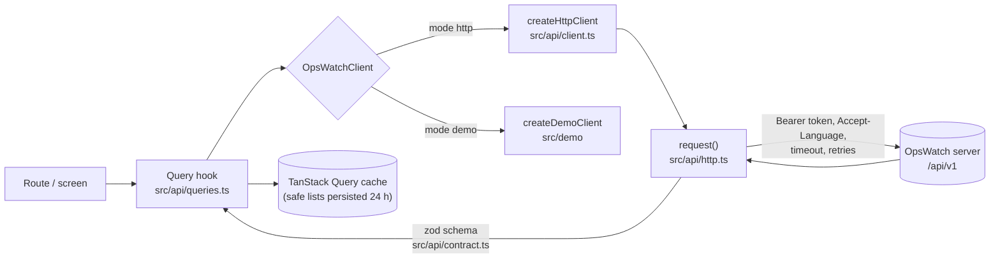

# Architecture

## Layers

```
apps/mobile/
  app/               expo-router routes (file-based): (auth) Connect and Login, (app) tabs and detail screens,
                     auth/callback, +native-intent.tsx (every incoming URL), +not-found
  src/features/      per-domain building blocks used by the routes (home, problems, errors, services, ...)
  src/ui/            design system: theme tokens, text, controls, layout, states, charts, code and log viewers
  src/api/           contract.ts (zod), http.ts (request), client.ts (OpsWatchClient), queries.ts (hooks),
                     errors.ts (ApiError), query-provider.tsx (TanStack Query + offline persistence)
  src/state/         session (server + token state machine), settings (preferences), storage, pending link
  src/lib/           pure helpers: server URL validation, deep links, notifications, PKCE, redacting logger, formatting
  src/app-shell/     providers, session effects, notification effects, privacy cover
  src/i18n/          en/ and fr/ catalogues, one file per namespace
  src/demo/          fixtures, demo engine and DemoClient
  src/test/          test providers and route tests
```

Rules:

- Routes stay thin: they compose hooks from `src/api/queries.ts` and components from `src/features` and `src/ui`.
- Screens never call `fetch`. `src/api/http.ts` is the only place that performs network requests (enforced by
  ESLint's `no-restricted-globals`).
- `src/api/contract.ts` has no React Native import so it can move to `packages/contract` unchanged.

## Data flow



`request()`:

- Builds the URL from the server base URL (a sub-path such as `/ops` is kept) and `/api/v1/...`.
- Sends `Authorization: Bearer <token>` when signed in, `Accept-Language`, JSON bodies, `credentials: 'omit'`
  (cookies are not part of the mobile contract).
- Times out every request (15 s default, 30 s for logs, 60 s for AI, 10 s for `server`).
- Retries only idempotent requests (GET, PUT, DELETE, or explicitly marked) on network errors, timeouts, 429 and
  502–504, at most 2 times, with jittered exponential backoff (400 ms base). React Query retries are off so retries
  are not multiplied.
- Parses JSON and validates it against the endpoint's zod schema. Schemas are lenient on purpose: unknown keys are
  dropped and unknown enum values from a newer server fall back to a neutral value.
- Never logs headers or bodies.

## Capability discovery

`GET /api/v1/server` is unauthenticated and returns `{ product: "opswatch", version, apiVersion, name?, auth:
{ password, google }, features: { ... } }`. The app calls it when connecting and refreshes it later; offline, the
last known capabilities are kept. `useFeature(name)` returns `false` for unknown or missing flags, and screens
render an explicit "Not available on this server" state. The sign-in screen shows password and/or Google according to
`auth`. The Connect screen refuses a server whose `apiVersion` differs from the app's (and says which side is
older); a later refresh that sees a different `apiVersion` logs a warning. The flags are listed in
[api-contract.md](api-contract.md#capability-flags).

## Error model

Every failure becomes an `ApiError` with a `kind`; screens switch on `kind`, never on raw HTTP statuses.

| Kind | Cause |
|------|-------|
| `network` | No connectivity, DNS, TLS failure, connection refused |
| `timeout` | Request exceeded its timeout |
| `unauthorized` | 401: session missing, expired or revoked. Expires the session |
| `forbidden` | 403 |
| `not_found` | 404 |
| `rate_limited` | 429 (retried when idempotent) |
| `validation` | Other 4xx, with the server's snake_case `code` |
| `server` | 5xx (502–504 retried when idempotent) |
| `unsupported` | 501: the server does not implement this capability |
| `invalid_response` | Body is not JSON or does not match the contract (wrong URL, proxy page, older/newer server). The message names the failing path, never values |
| `cancelled` | The caller aborted |

Error bodies follow `{ error: code, message?, action?, code? }`. `action` carries the provider permission behind an
access failure (for example `logs:StartQuery`) so the screen can say what is missing.

## Session state machine

```
loading ──► no-server ──► signed-out ──► signed-in
               ▲              ▲   │           │
               │              │   └─ sign in ─┘
               └── forget ────┴── expire (401) / sign out
```

- `loading`: restores the stored server (AsyncStorage) and the token (secure storage, key derived from the server URL).
- `no-server`: Connect screen (server URL test, or demo).
- `signed-out`: Login screen for a chosen server, with a reason (`expired`, `signed-out`).
- `signed-in`: tabs. The token is kept in memory and read by the HTTP client at call time.

Ending a session runs listeners first (push unregistration, cache wipe) while the token still works, then calls
`POST /auth/logout` (sign-out only, best effort so offline sign-out works), then deletes the token. Any 401 from an
authenticated call expires the session. A token remembered for a server is re-validated with `GET /me` before it is
trusted again. Google sign-in: [security.md](security.md#oauth-redirects).

## Offline cache

| Rule | Value |
|------|-------|
| Persisted queries | List queries whose key root is `health`, `brief`, `problems`, `services`, `incidents` or `environments` |
| Never persisted | Details, logs, stack traces, evidence, AI answers, search |
| Storage | AsyncStorage key `opswatch.query-cache.v1` |
| Maximum age | 24 hours |
| Buster | `serverUrl|userEmail`: another server or user never sees this cache |
| Wiped | On sign-out, session expiry and server change |

Queries use `networkMode: 'offlineFirst'`, refetch on focus and reconnect (NetInfo and AppState), and every data
screen shows when it was last updated. Cached data shown offline or after a failed refetch is marked stale, never
presented as live.

## Deep links

`app/+native-intent.tsx` receives every URL the OS hands to the app (URL scheme, universal/app link, notification)
and passes it through `parseDeepLink` (`src/lib/deep-links.ts`):

- Accepted forms: `opswatch://problems/<id>`, `opswatch:///problems/<id>`,
  `https://<associated domain>/m/problems/<id>`, and internal paths.
- Only listed top-level screens and `<type>/<id>` routes for linkable types are allowed; ids must match
  `^[A-Za-z0-9._:~-]{1,200}$`.
- Query strings and fragments are dropped: a link cannot pre-fill an action or carry a token.
- Anything else opens Home. `opswatch://auth/callback` is reserved for the Google sign-in round trip.
- A signed-out user's destination is kept in memory only (`src/state/pending-link.ts`) and restored after sign-in.

## Notifications

`expo-notifications`, categories `critical_problem`, `alert`, `synthetic_failure`, `incident`, `recovery`. Payload
data is a reference `{ type, id, env? }` routed through the same allow-list. Details in
[notifications.md](notifications.md).

## Internationalisation

English and French. Catalogues live in `src/i18n/en/<namespace>.ts` and `src/i18n/fr/<namespace>.ts` (auth, common,
home, problems, errors, services, ...). English is the source of truth; French must define exactly the same keys, and
a missing key is a type error. The locale follows the device (`expo-localization`) unless set in Settings.
Placeholders use `{name}`.

## Theming

`src/ui/theme.ts` defines light and dark palettes with the same keys; components read colours only through
`useTheme()`. Theme follows the system or the user's choice. Status colours meet WCAG AA against their tint and are
always paired with an icon and a word, never colour alone. Production environments have their own visual treatment.

## Testing strategy

| Level | Tools | Examples |
|-------|-------|----------|
| Unit | Jest (jest-expo) | HTTP errors and retries, contract validation, redaction, URL validation, deep links, notification routing, formatting, chart maths |
| Component | React Native Testing Library, `src/test/render.tsx` providers | Status badge, stale banner, viewers, filters, feature gate |
| Navigation | `renderRouter('./app')` from `expo-router/testing-library` | Auth gate, Home on demo data |
| Integration | HTTP client against the mock server | Sign-in, pagination, error kinds |
| Web smoke | Playwright on the web export | Small/large phone and tablet viewports |
| Device E2E | Maestro flows | Emulators and phones |

Commands and the release checklist: [testing.md](testing.md).
