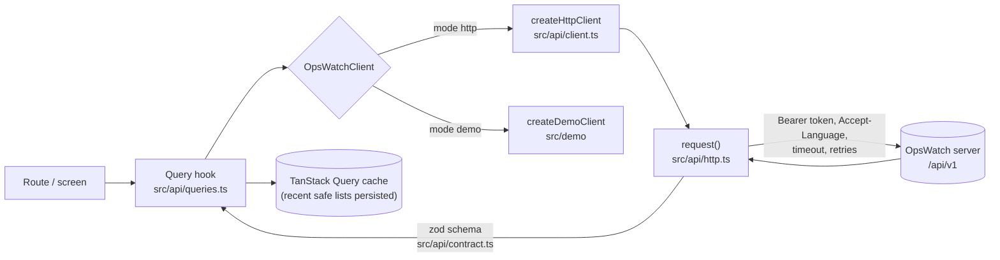

# Architecture

## Layers

```
apps/mobile/
  app/               expo-router routes (file-based): (auth) Connect and Login, (app) tabs and detail screens,
                     auth/callback, +native-intent.tsx (every incoming URL), +not-found
  src/features/      per-domain building blocks used by the routes (home, problems, errors, services, settings, ...)
  src/ui/            design system: theme tokens and provider, text, controls, layout, states, charts, code and
                     log viewers
  src/api/           contract.ts (zod), http.ts (request), client.ts (OpsWatchClient), queries.ts (hooks),
                     errors.ts (ApiError), query-provider.tsx (TanStack Query + offline persistence)
  src/state/         session (server + token state machine), settings (preferences), storage, pending link
  src/lib/           pure helpers: server URL validation, deep links, notifications, PKCE, haptics, redacting
                     logger, formatting
  src/app-shell/     providers, session effects, notification effects, privacy cover
  src/i18n/          en/ and fr/ catalogues, one file per namespace
  src/demo/          fixtures, demo engine and DemoClient
  src/test/          test providers and route tests
  dev/mock-server.ts the contract mock server, also used by the integration test
  e2e/               maestro/ device flows, web/ Playwright smoke tour of the web export
```

Rules:

- Routes stay thin: they compose hooks from `src/api/queries.ts` and components from `src/features` and `src/ui`.
- Screens never call `fetch`. `src/api/http.ts` is the only place that performs network requests (enforced by
  ESLint's `no-restricted-globals`).
- `src/api/contract.ts` has no React Native import, so it can be replaced by a re-export of `packages/contract`
  without touching anything else ([api-contract.md](api-contract.md#parity-with-packagescontract)).

## Data flow



`request()`:

- Builds the URL from the server base URL (a sub-path such as `/ops` is kept) and `/api/v1/...`.
- Sends `Authorization: Bearer <token>` when signed in, `Accept-Language`, JSON bodies, `credentials: 'omit'`
  (cookies are not part of the mobile contract).
- Times out every request (15 s default, 30 s for log search and polling, 5 s to cancel a log search, 60 s for AI,
  10 s for `server`). The timer is cleared only after the body has been read and parsed, so a server that answers
  headers quickly and then stalls still hits the timeout.
- **Refuses an answer from another origin.** If `response.url` is not the origin the request went to — a redirect
  that would have carried the bearer token elsewhere — the result is `invalid_response`, not data.
- Retries only idempotent requests (GET, PUT, DELETE, or explicitly marked) on network errors, timeouts, 429 and
  502–504, at most 2 times, with jittered exponential backoff (400 ms base). React Query retries are off so retries
  are not multiplied.
- **Honours `Retry-After`** on a rate-limited answer: the delay before the next attempt is the value the server asked
  for, capped at 30 s (beyond that the error surfaces instead of the app sleeping through it). Only the seconds form
  is read; an HTTP-date falls back to the usual backoff.
- Parses JSON and validates it against the endpoint's zod schema. Schemas are lenient on purpose: unknown keys are
  dropped and unknown enum values from a newer server fall back to a neutral value.
- Never logs headers or bodies.

## Capability discovery

`GET /api/v1/server` is unauthenticated and returns `{ product: "opswatch", version, apiVersion, name?, demo?, auth:
{ password, google }, features: { ... } }`. The app calls it when connecting and refreshes it when a session starts;
offline, the last known capabilities are kept.

The app distinguishes two situations, because they call for different words and different actions:

| Situation | What the app knows | What it shows |
|-----------|--------------------|---------------|
| `features.x` is `false` or absent | This server does not provide the feature | "Not available on this server". No retry: nothing will change until the server changes |
| No `serverInfo` at all (never reached, or the answer was not understood) | The app has not been able to ask | An "unknown" state with a **Retry**, which re-runs `GET /server` |

`useFeature(name)` answers the yes/no question and returns `false` for anything unconfirmed; `useFeatureStatus`
(`src/ui/states.tsx`) returns `available | unavailable | unknown` and drives `FeatureGate`. The sign-in screen shows
password and/or Google according to `auth`. The Connect screen refuses a server whose `apiVersion` differs from the
app's (and says which side is older); a later refresh that sees a different `apiVersion` logs a warning. The flags are
listed in [api-contract.md](api-contract.md#capability-flags).

In demo mode only, Settings → Demo capabilities can switch advertised features off locally
(`withDemoCapabilities` in `src/state/session.tsx`), so the degraded states can be seen without a second server.

## Error model

Every failure becomes an `ApiError` with a `kind`; screens switch on `kind`, never on raw HTTP statuses.

| Kind | Cause |
|------|-------|
| `network` | No connectivity, DNS, TLS failure, connection refused |
| `timeout` | Request exceeded its timeout (including the body read) |
| `unauthorized` | 401: session missing, expired or revoked. Expires the session |
| `forbidden` | 403 |
| `not_found` | 404 |
| `rate_limited` | 429 (retried when idempotent, after `Retry-After` when the server sent one) |
| `validation` | Other 4xx, with the server's snake_case `code` |
| `server` | 5xx (502–504 retried when idempotent) |
| `unsupported` | 501: the server does not implement this capability |
| `invalid_response` | Body is not JSON, came from another origin, or does not match the contract (wrong URL, proxy page, older/newer server). The message names the failing path, never values |
| `cancelled` | The caller aborted |

Error bodies follow `{ error: code, message?, action?, code? }`. `action` carries the provider permission behind an
access failure (for example `logs:StartQuery`) so the screen can say what is missing.

## Session state machine

```
loading ──► no-server ──► signed-out ──► signed-in
               ▲              ▲   │           │
               │              │   └─ sign in ─┘
               └── forget ────┴── expire (401) / sign out
```

- `loading`: restores the stored server (AsyncStorage) and the token (secure storage, key derived from the server URL).
- `no-server`: Connect screen (server URL test, or demo).
- `signed-out`: Login screen for a chosen server, with a reason (`expired`, `signed-out`).
- `signed-in`: tabs. The token is kept in memory and read by the HTTP client at call time.

**Ending a session is local first.** The token is removed from memory and from the Keychain and the state changes
before any network call, so a hanging network can never leave the app showing production data with a live token.
Only then, and without blocking the user, do the session-end listeners run (offline cache wipe, push unregistration,
forgetting server-scoped settings) through a client that still holds the old token, followed by `POST /auth/logout`
for an explicit sign-out. An expired token is not revoked: it is already worthless. Any 401 from an authenticated
call expires the session. A token remembered for a server is re-validated with `GET /me` before it is trusted again.
Google sign-in: [security.md](security.md#oauth-redirects).

## Offline cache

| Rule | Value |
|------|-------|
| Persisted queries | Only **list** queries (`[root, 'list', …]`) whose root is `health`, `brief`, `problems`, `services`, `incidents` or `environments`, and only when they succeeded |
| Never persisted | Details, logs, stack traces, evidence, AI answers, search |
| Storage | One file per key in the OS cache directory: `opswatch-cache/opswatch.query-cache.v1.json` (`src/state/cache-storage.ts`). Neither platform backs that directory up, and the OS may delete it under storage pressure, which is the right trade for data whose worst case is a reload. Web (QA only) falls back to AsyncStorage |
| Maximum size | 2 MB per snapshot (`MAX_CACHE_BYTES`); a larger one is dropped rather than half-written, because a silently failing cache is worse than a missing one |
| Maximum age | 24 hours (`CACHE_MAX_AGE_MS`), applied per query, not only to the snapshot |
| Maximum number | 24 queries (`MAX_PERSISTED_QUERIES`), most recently fetched first: filter combinations are unlimited, a phone's cache is not |
| Buster | `serverUrl|userEmail`: another server or user never sees this cache |
| Wiped | On sign-out, session expiry and server change |

The persister is mounted only once the session has been read (`state.status !== 'loading'`): mounting it earlier
would compare the stored cache against a placeholder key and throw the whole cache away on every cold start.

Queries use `networkMode: 'offlineFirst'`, refetch on focus and reconnect (NetInfo and AppState), and every data
screen shows when it was last updated. Cached data shown offline or after a failed refetch is marked stale, never
presented as live.

## Deep links

`app/+native-intent.tsx` receives every URL the OS hands to the app (URL scheme, universal/app link, notification)
and passes it through `parseDeepLink` (`src/lib/deep-links.ts`):

- Accepted forms: `opswatch://problems/<id>`, `opswatch:///problems/<id>`,
  `https://<associated domain>/m/problems/<id>`, and internal paths.
- Only listed top-level screens and `<type>/<id>` routes for linkable types are allowed; ids must match
  `^[A-Za-z0-9._:~-]{1,200}$`, and an id made only of dots is refused (a URL parser turns it into a path walk).
- Query strings and fragments are dropped: a link cannot pre-fill an action or carry a token.
- Anything else opens Home. `opswatch://auth/callback` is reserved for the Google sign-in round trip.
- A signed-out user's destination is kept in memory only (`src/state/pending-link.ts`) and restored after sign-in.

## Notifications

`expo-notifications`, categories `critical_problem`, `alert`, `synthetic_failure`, `incident`, `recovery`. Payload
data is a reference `{ type, id, env? }` routed through the same allow-list. The same notification delivered or
replayed twice is suppressed within a 60 s window, and a tap first selects the environment the notification was about,
so the object that opens is the right one. Details in [notifications.md](notifications.md).

## Internationalisation

English and French. Catalogues live in `src/i18n/en/<namespace>.ts` and `src/i18n/fr/<namespace>.ts` (auth, common,
home, problems, errors, services, ...). English is the source of truth; French must define exactly the same keys, and
a missing key is a type error. The locale follows the device (`expo-localization`) unless set in Settings.
Placeholders use `{name}`.

## Theming

`src/ui/theme.ts` defines light and dark palettes with the same keys; components read colours only through
`useTheme()`. The theme provider also sets the native root background (`expo-system-ui`), so no white flash shows
behind the app in dark mode. Theme follows the system or the user's choice. Status colours meet WCAG AA against their
tint (checked by a test over every pair, in both palettes) and are always paired with an icon and a word, never colour
alone. Production environments have their own visual treatment.

## Chrome above the navigator

In demo mode a banner sits above the whole navigator and covers the status bar, so everything under it must start with
no top inset. `app/(app)/_layout.tsx` provides a zeroed `SafeAreaInsetsContext` for that, which the tabs honour because
their header is drawn in JavaScript.

The stack's **native** header does not honour it. Since Android 15's edge-to-edge enforcement, react-native-screens
hard-codes the toolbar's top inset (`shouldApplyTopInset = true`; `setTopInsetEnabled` is now a no-op), so the banner
and the header each reserved the status bar height and left an empty strip between them. While the banner is up the
navigator therefore supplies its own header, `src/ui/stack-header.tsx`, which removes the strip on both platforms
without depending on how either treats the inset. A signed-in session has no banner and keeps the native header.

## Testing strategy

| Level | Tools | Examples |
|-------|-------|----------|
| Unit | Jest (jest-expo) | HTTP errors, retries and `Retry-After`, contract validation, redaction, URL validation, deep links, notification routing and dedupe, formatting, chart maths |
| Component | React Native Testing Library, `src/test/render.tsx` providers | Status badge, stale banner, viewers, filters, feature gate, degraded states |
| Navigation | `renderRouter('./app')` from `expo-router/testing-library` | Auth gate, Home on demo data, session lifecycle |
| Integration | HTTP client against the mock server, over real HTTP | Sign-in, pagination, error kinds, log polling, logout |
| Contract parity | Jest against `packages/contract` when present | Every schema exported, demo data parsed to a superset |
| Web smoke | Playwright on the web export | Six phone/tablet/dark profiles |
| Device E2E | Maestro flows | Emulators and phones |

Commands, counts and the release checklist: [testing.md](testing.md).
